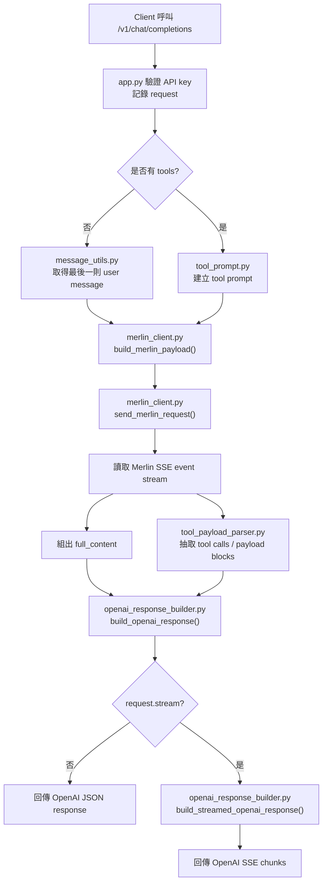

# Merlin Adapter 流程說明

## 這個專案在做什麼

這個專案接收 OpenAI 相容格式的聊天請求，轉送到 Merlin，然後再把 Merlin 的回應轉回 OpenAI API 相容格式。

## 高階流程

1. Client 呼叫 `POST /v1/chat/completions`
2. [app.py](/C:/Users/BigTongue/Documents/git%20project/merlinai-adapter-server/merlinai_adapter_server/app.py) 驗證 API key，並記錄 request
3. 系統判斷這次請求是不是 tool-calling 模式
4. 建立要送給 Merlin 的 payload
5. [merlin_client.py](/C:/Users/BigTongue/Documents/git%20project/merlinai-adapter-server/merlinai_adapter_server/merlin_client.py) 把 request 送到 Merlin
6. 讀取 Merlin 回傳的 SSE event stream
7. 把 Merlin 的文字內容與可能的 tool call 解析出來
8. [openai_response_builder.py](/C:/Users/BigTongue/Documents/git%20project/merlinai-adapter-server/merlinai_adapter_server/openai_response_builder.py) 組成 OpenAI 相容回應
9. 回傳：
   - 一般 JSON 回應
   - 或 OpenAI chunk streaming 回應

## 流程圖

## 各模組責任

### [app.py](/C:/Users/BigTongue/Documents/git%20project/merlinai-adapter-server/merlinai_adapter_server/app.py)

職責：
- FastAPI 入口
- 驗證 `Authorization`
- 記錄 request / response debug 資訊
- 串接整體流程

重點：
- `_build_merlin_payload_for_request()`
- `_execute_merlin_request()`
- `/v1/chat/completions`

### [merlin_client.py](/C:/Users/BigTongue/Documents/git%20project/merlinai-adapter-server/merlinai_adapter_server/merlin_client.py)

職責：
- 建立 Merlin HTTP payload
- 發送 HTTP request 到 Merlin
- 讀取 Merlin SSE stream
- 抽出 `full_content` 與 upstream tool calls

重點：
- `build_merlin_payload()`
- `send_merlin_request()`
- `_read_merlin_event_stream_with_allowed_tools()`

### [message_utils.py](/C:/Users/BigTongue/Documents/git%20project/merlinai-adapter-server/merlinai_adapter_server/message_utils.py)

職責：
- 從 OpenAI `messages` 抽出純文字
- 取得最後一則 user message
- 建立給 tool prompt 使用的對話摘要 transcript

重點：
- `extract_message_text()`
- `get_last_user_message()`
- `build_conversation_transcript()`

### [tool_prompt.py](/C:/Users/BigTongue/Documents/git%20project/merlinai-adapter-server/merlinai_adapter_server/tool_prompt.py)

職責：
- 判斷是否要強制走 tool JSON 模式
- 正規化 `tool_choice`
- 壓縮 tools schema
- 組出真正送給 Merlin 的 tool prompt
- 判斷 tool mode 失敗時是否值得 retry

重點：
- `normalize_tool_choice()`
- `should_force_tool_json()`
- `compact_tools_for_prompt()`
- `build_tool_prompt()`
- `should_retry_tool_response()`

### [tool_payload_parser.py](/C:/Users/BigTongue/Documents/git%20project/merlinai-adapter-server/merlinai_adapter_server/tool_payload_parser.py)

職責：
- 解析 `<OPENAI_TOOL_PAYLOAD>...</OPENAI_TOOL_PAYLOAD>` 區塊
- 嘗試修復壞掉的 JSON
- 從 Merlin event 或 payload block 抽出 tool calls
- 過濾不在 allow-list 裡的 tool call

重點：
- `extract_structured_payload_blocks()`
- `try_parse_structured_payloads()`
- `extract_tool_calls()`
- `extract_tool_calls_from_json_payload()`
- `resolve_payload_result()`

### [openai_response_builder.py](/C:/Users/BigTongue/Documents/git%20project/merlinai-adapter-server/merlinai_adapter_server/openai_response_builder.py)

職責：
- 決定最後回應應該是 message 還是 tool_calls
- 驗證 tool-calling 規則有沒有被滿足
- 建立 OpenAI 非串流回應
- 建立 OpenAI 串流回應

重點：
- `build_openai_response()`
- `build_streamed_openai_response()`
- `_validate_response_mode()`

### [protocol_constants.py](/C:/Users/BigTongue/Documents/git%20project/merlinai-adapter-server/merlinai_adapter_server/protocol_constants.py)

職責：
- 放共用常數
- 放 `ToolPromptMode`
- 放 structured payload 的起訖標記

## 詳細流程

### A. 一般聊天請求

1. [app.py](/C:/Users/BigTongue/Documents/git%20project/merlinai-adapter-server/merlinai_adapter_server/app.py) 用 `get_last_user_message()` 取得最後一則 user message
2. [merlin_client.py](/C:/Users/BigTongue/Documents/git%20project/merlinai-adapter-server/merlinai_adapter_server/merlin_client.py) 把這段文字塞進 Merlin payload
3. Merlin 回傳 SSE events
4. [merlin_client.py](/C:/Users/BigTongue/Documents/git%20project/merlinai-adapter-server/merlinai_adapter_server/merlin_client.py) 組出 `full_content`
5. [openai_response_builder.py](/C:/Users/BigTongue/Documents/git%20project/merlinai-adapter-server/merlinai_adapter_server/openai_response_builder.py) 轉成 OpenAI assistant message

### B. Tool-calling 請求

1. [app.py](/C:/Users/BigTongue/Documents/git%20project/merlinai-adapter-server/merlinai_adapter_server/app.py) 偵測到 `request.tools`
2. [tool_prompt.py](/C:/Users/BigTongue/Documents/git%20project/merlinai-adapter-server/merlinai_adapter_server/tool_prompt.py) 建立嚴格的 tool prompt
3. 這個 prompt 會被當成送給 Merlin 的主要 message content
4. Merlin 可能回傳：
   - event stream 中的 tool calls
   - payload block 內的結構化 JSON
   - 一般純文字
5. [tool_payload_parser.py](/C:/Users/BigTongue/Documents/git%20project/merlinai-adapter-server/merlinai_adapter_server/tool_payload_parser.py) 把可用的 tool 資訊抽出來
6. [openai_response_builder.py](/C:/Users/BigTongue/Documents/git%20project/merlinai-adapter-server/merlinai_adapter_server/openai_response_builder.py) 決定最後應回：
   - tool call
   - 一般 assistant message
   - 或 `422`

## 遇到問題時該看哪裡

### tool prompt 不對

看：
- [tool_prompt.py](/C:/Users/BigTongue/Documents/git%20project/merlinai-adapter-server/merlinai_adapter_server/tool_prompt.py)

### Merlin event 解析不對

看：
- [merlin_client.py](/C:/Users/BigTongue/Documents/git%20project/merlinai-adapter-server/merlinai_adapter_server/merlin_client.py)
- [tool_payload_parser.py](/C:/Users/BigTongue/Documents/git%20project/merlinai-adapter-server/merlinai_adapter_server/tool_payload_parser.py)

### OpenAI 回應格式不對

看：
- [openai_response_builder.py](/C:/Users/BigTongue/Documents/git%20project/merlinai-adapter-server/merlinai_adapter_server/openai_response_builder.py)

### message / transcript 處理不對

看：
- [message_utils.py](/C:/Users/BigTongue/Documents/git%20project/merlinai-adapter-server/merlinai_adapter_server/message_utils.py)

## 補充

- 舊的 `openai_adapter.py` 已移除，因為它只是轉手 export，沒有實際邏輯。
- 舊的 `merlin_protocol.py` 已拆掉，避免 prompt、parser、response builder 全部混在同一檔。
- 現在如果你要調整某一段行為，比較容易定位責任模組，不用在單一大檔裡來回找。
